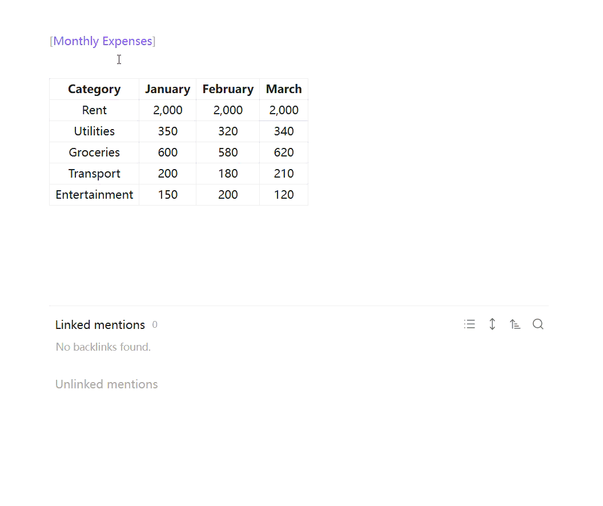

# HTML Tables

Enhanced table support for Obsidian with advanced features like table headers, cell merging, and more.



## Features

- **Table Headers**: Support for header rows and header columns
- **Cell Merging**: Merge cells horizontally and vertically
- **Column Resizing**: Drag to resize columns, auto-fit, and equalize column widths
- **Table Captions**: Add captions above tables
- **Formula Support**: Basic formula support in table cells
- **Multiline Cells**: Support for newlines within cells
- **Alignment Options**: Horizontal and vertical alignment for cells
- **Context Menu**: Right-click context menu for table operations
- **Preview Mode Support**: All features work in Obsidian's preview mode

## Installation

1. Download the latest release from GitHub
2. Copy `main.js`, `manifest.json`, and `styles.css` to your vault: `VaultFolder/.obsidian/plugins/html-tables/`
3. Enable the plugin in Settings → Community plugins

## Usage

### Basic Usage

The plugin automatically enhances tables in preview mode. Simply create a standard markdown table:

```markdown
| Header 1 | Header 2 | Header 3 |
|----------|----------|----------|
| Cell 1   | Cell 2   | Cell 3   |
| Cell 4   | Cell 5   | Cell 6   |
```

### Table Captions

Add a caption by placing a paragraph starting with "Table:" before your table:

```markdown
Table: My Table Caption

| Header 1 | Header 2 |
|----------|----------|
| Cell 1   | Cell 2   |
```

### Commands

- **Toggle header row**: Toggle the first row as a header
- **Toggle header column**: Toggle the first column as a header
- **Add table caption**: Add a caption to the current table

### Context Menu

Right-click on any table to access:
- Toggle Header Row
- Toggle Header Column
- Add Caption
- Auto-fit Columns
- Equal Column Width

### Column Resizing

- **Drag to resize**: Hover over the right edge of a header cell and drag to resize
- **Double-click to auto-fit**: Double-click the resize handle to auto-fit the column width
- **Equal column widths**: Use the context menu to make all columns equal width

### Formula Support

Use formulas in table cells by starting with `=`:
```markdown
| Value 1 | Value 2 | Sum |
|---------|---------|-----|
| 10      | 20      | =10+20 |
```

### Multiline Cells

Use `\n` for newlines within cells:
```markdown
| Description |
|-------------|
| Line 1\nLine 2 |
```

## Settings

- **Enable advanced tables**: Enable/disable all advanced features
- **Enable header row**: Automatically format the first row as a header
- **Enable header column**: Automatically format the first column as a header
- **Enable cell merging**: Allow merging cells in tables
- **Enable formula support**: Support formulas in table cells (starting with =)
- **Enable newline in cells**: Support newlines in table cells using \n
- **Enable table caption**: Support table captions above the table
- **Default horizontal alignment**: Default horizontal alignment for table cells
- **Default vertical alignment**: Default vertical alignment for table cells

## Examples

### Complete Example

```markdown
Table: Quarterly Sales Report

| Product | Q1 | Q2 | Q3 | Q4 | Total |
|---------|----|----|----|----|-------|
| Widget A | 100 | 150 | 200 | 250 | =100+150+200+250 |
| Widget B | 80 | 120 | 160 | 200 | =80+120+160+200 |
| Widget C | 50 | 75 | 100 | 125 | =50+75+100+125 |
```

### Table with Multiline Cells

```markdown
| Feature | Description |
|---------|-------------|
| Header Rows | Automatically format the first row as a header\nwith bold text and centered alignment |
| Header Columns | Automatically format the first column as a header\nwith bold text and centered alignment |
```

### Table with Alignment

```markdown
| Left Aligned | Center Aligned | Right Aligned |
|:-------------|:--------------:|--------------:|
| Text | Text | Text |
| More text | More text | More text |
```

## Development

1. Clone this repository
2. Run `bun install` to install dependencies
3. Run `bun run dev` to start development with hot reload
4. Run `bun run build` to build for production

## Contributing

Contributions are welcome! Please feel free to submit a Pull Request.

## License

BSD-0-Clause License